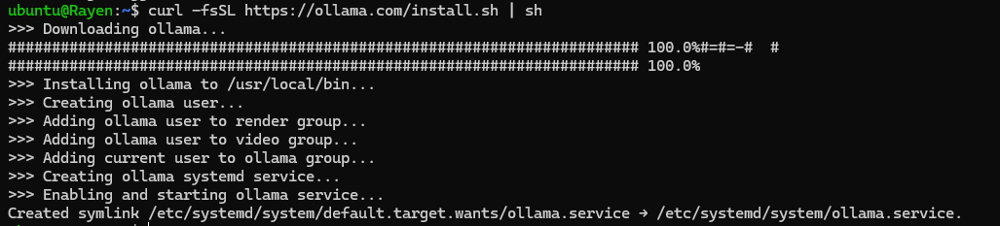
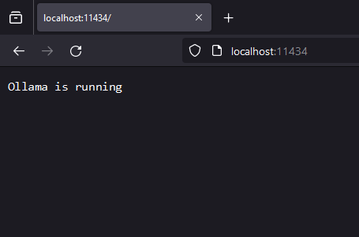
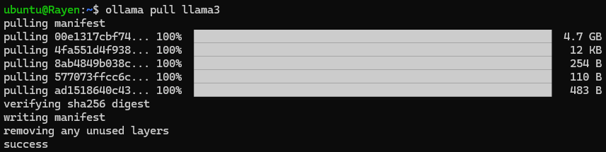
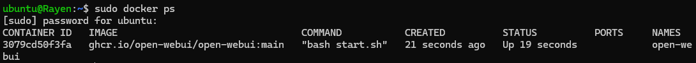
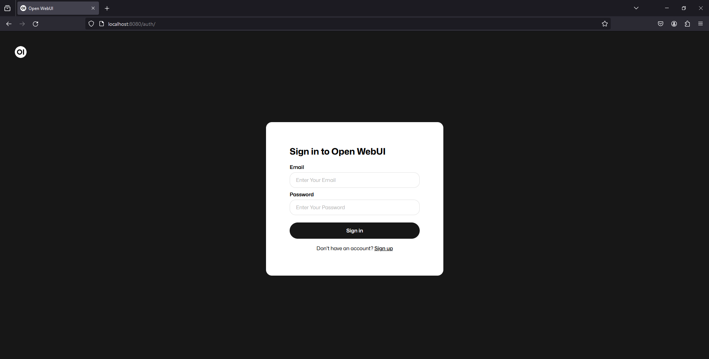
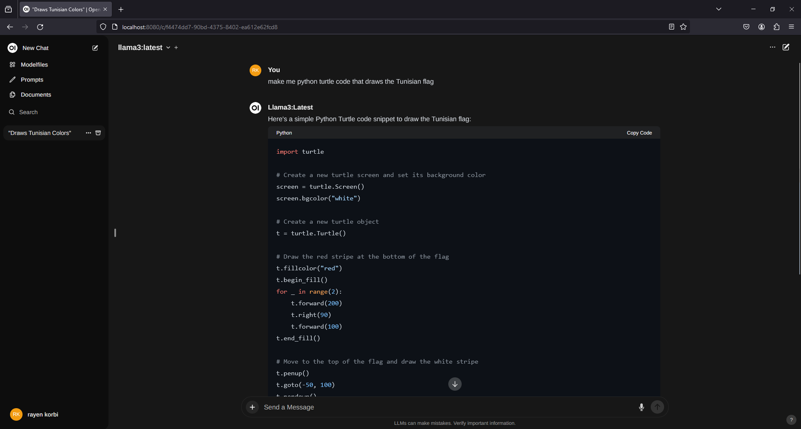

# ***Host your AI locally by Rayen korbi***

</br>
</br>

First of all, will be using Linux WSL on Windows 11
### ***1/*** Step 1:
open cmd and type: `wsl --install`
then create your account 

after that type : `sudo apt update`  then  `sudo apt upgrade -y`
so you get the latest version of you
  

</br>

### ***2/*** Step 2:
now you have your ubuntu opened in your terminal type :
`curl -fsSL https://ollama.com/install.sh | sh`
so you can get ollama on your Linux terminal


once you have finished open your bowser and type in the url : `http://localhost:11434`
you should see this:



now it's time to install our AI module 

  
</br>
</br>

### ***3/*** Step 3:
open back your ubuntu terminal and type : `ollama pull llama3`

(keep in mind that you can download any model you want from this link : 
https://ollama.com/library)
all you have to do is type: `ollama pull {model name}`
model name is the name of the model that you have chosen




  
</br>
</br>

### ***4/*** Step 4:
after installing our llama3 model now we need to make an open webUI so we can use our AI module in a beautiful interface .
to do it you need to go back to ubuntu and paste this code to install docker :
```bash
# Add Docker's official GPG key:
sudo apt-get update
sudo apt-get install ca-certificates curl
sudo install -m 0755 -d /etc/apt/keyrings
sudo curl -fsSL https://download.docker.com/linux/ubuntu/gpg -o /etc/apt/keyrings/docker.asc
sudo chmod a+r /etc/apt/keyrings/docker.asc

# Add the repository to Apt sources:
echo \
  "deb [arch=$(dpkg --print-architecture) signed-by=/etc/apt/keyrings/docker.asc] https://download.docker.com/linux/ubuntu \
  $(. /etc/os-release && echo "$VERSION_CODENAME") stable" | \
  sudo tee /etc/apt/sources.list.d/docker.list > /dev/null
sudo apt-get update
```

after it finishes continue pasting this code: 
```bash 
sudo apt-get install docker-ce docker-ce-cli containerd.io docker-buildx-plugin docker-compose-plugin 
``` 

run the docker container:
```bash 
sudo docker run -d --network=host -v open-webui:/app/backend/data -e OLLAMA_BASE_URL=http://127.0.0.1:11434 --name open-webui --restart always ghcr.io/open-webui/open-webui:main
``` 

after it finishes type this line of code to test if it is installed correctly or not : 
```bash 
sudo docker ps
``` 
it should show up like this :



</br>  
</br>


### ***5/*** Step 5:
now you have docker installed return back to your browser and type in the URL `localhost:8080` and sign in



</br>


congratulations🎉 , you now have a local AI that doesn't require internet to work!!



***

**What, did I hear you want more ?!**
**More updates in the future inshalah**
